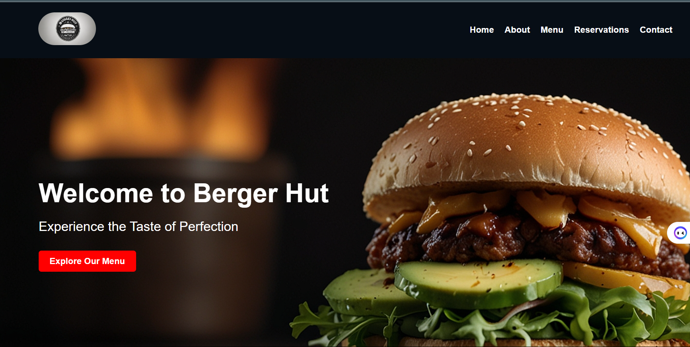
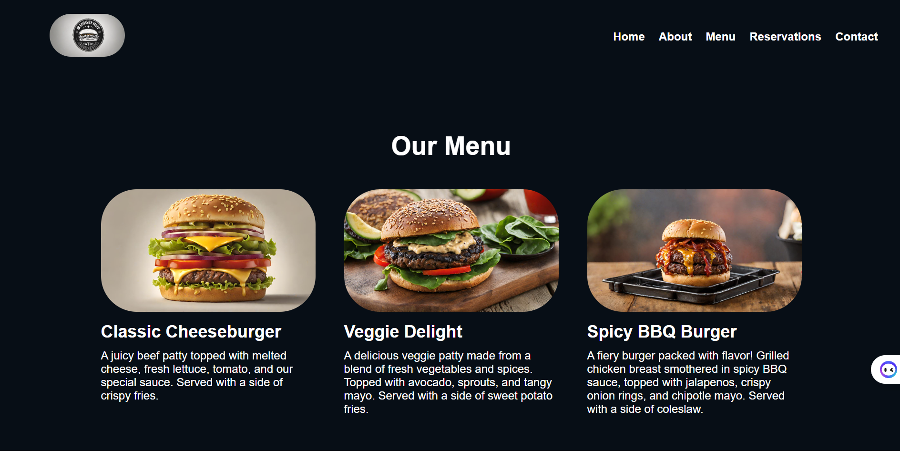
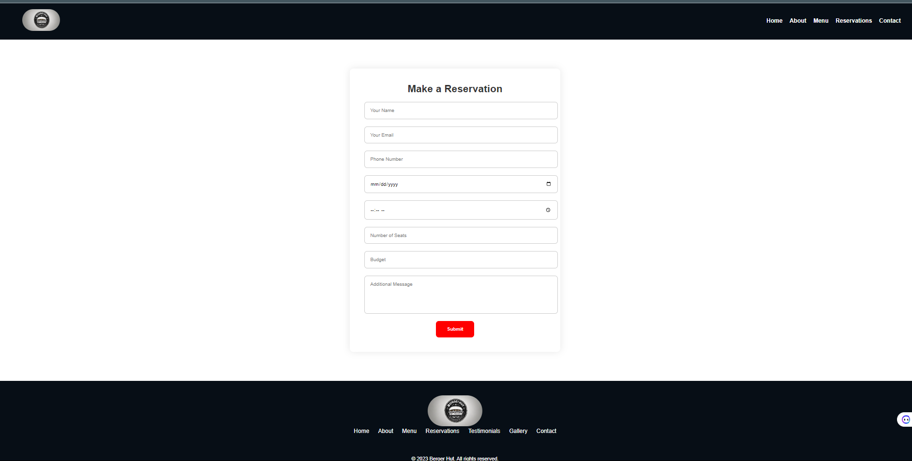

# Burger Hut Website

Welcome to the Burger Hut Website repository! This project is a simple yet modern website for a fictional burger restaurant, showcasing various HTML and CSS techniques for creating a responsive and visually appealing web presence.

## Screenshots

*Homepage*

*Menu Page*

*Reservation Form*

## Features

- **Dynamic Homepage**: Engage visitors with a dynamic homepage featuring a hero section and enticing call-to-action buttons.
- **Menu Display**: Showcase your mouthwatering burger offerings with a visually appealing menu display.
- **Reservation Form**: Allow customers to conveniently make reservations directly from the website.
- **Testimonials Section**: Build trust and credibility with customer testimonials prominently displayed on the site.
- **Gallery**: Show off your restaurant's ambiance and delicious food with a gallery of images.
- **Contact Form**: Make it easy for customers to get in touch with you through a user-friendly contact form.

## Technologies Used

- HTML5
- CSS3

## Getting Started

To get started with the Burger Hut Website project, simply clone this repository to your local machine:

git clone https://github.com/your-username/burger-hut-website.git

Then, open the index.html file in your web browser to view the website.

## Contributing
Contributions are welcome! If you'd like to contribute to the project, feel free to fork this repository, make your changes, and submit a pull request. Please ensure that your code follows the established coding standards and practices.

## License
This project is licensed under the MIT License - see the LICENSE file for details.

## Acknowledgements
Special thanks to OpenAI for providing the assistance in generating images for this project.
